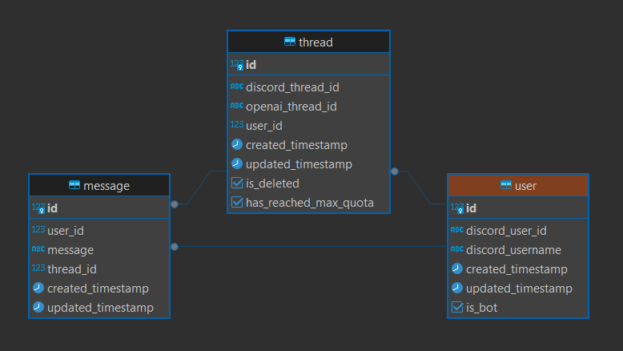

# AI DISCORD BOT

### What is it
This project is an AI assistant for discord servers.

### Getting started
1. Clone repository

2. Install libraries:
```cmd
npm install
```
3. Start the bot:
```cmd
npm run start
```

### Stack
Frontend => Discord

Backend => Node.js, OpenAI

Database => PostgreSQL

### DB Model
