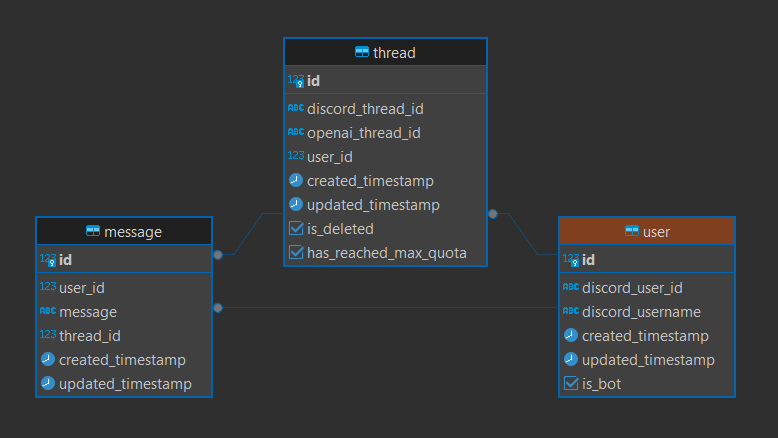
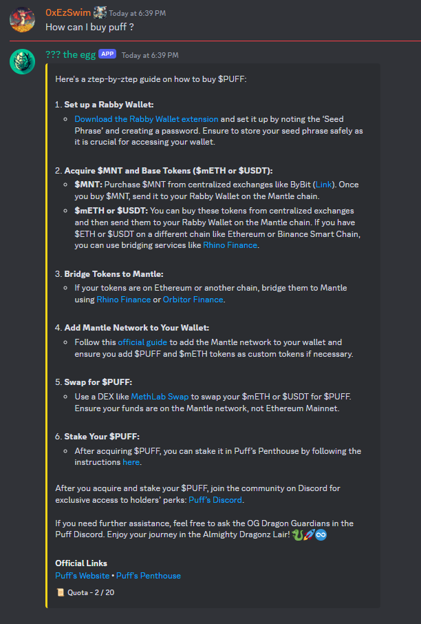

# Puff The Dragon discord bot

This project is an AI bot for Puff The Dragon discord server. 

The objective of the bot is to offer on demande and personal Q&A to discord members in private threads.

### Getting started
1. Clone repository

2. Install libraries:
```cmd
npm install
```
3. Add .env file:
```javascript
DATABASE_URL = ""
DISCORD_BOT_TOKEN = ""
DISCORD_CHANNEL_DURATION_IN_MS = ""
DISCORD_CHANNEL_ID = ""
DISCORD_QUESTION_MAX = ""
OPEN_AI_API_KEY = ""
OPEN_AI_ASSISTANT_ID = ""
OPEN_AI_ORGANIZATION_ID = ""
```
5. Start the bot:
```cmd
npm run start
```

### Stack
Frontend => Discord

Backend => Node.js, OpenAI

Database => PostgreSQL

### DB Model


### Question and answer example

